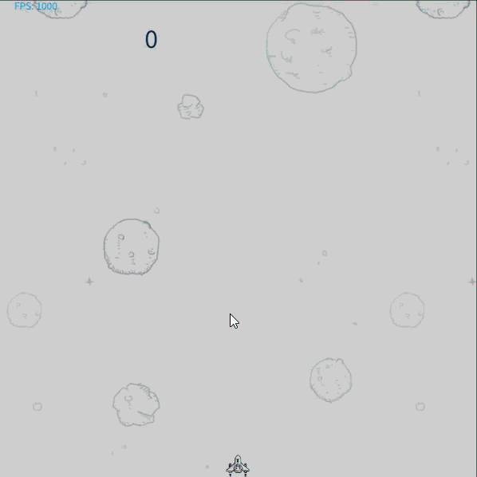
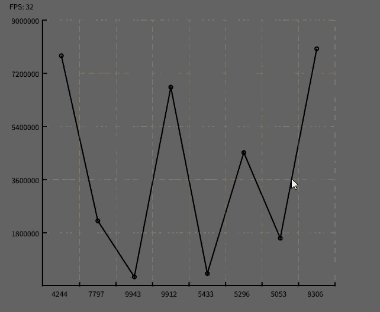

# Pepper

## 演示

<!-- - 组件开发示例：`/src/components/Ring.js`   -->
<!-- - 客户端使用示例： `/public/index.html` -->

- `demo/飞机大战/aircraft.html`

https://github.com/user-attachments/assets/13e0c53a-2327-4b7f-85a9-8a2188d69ec7.MP4

- `demo/图表/bar.html`

https://github.com/user-attachments/assets/d2146cb5-6c73-44f8-87f4-a4e54f412e35.mp4

- `demo/图表/brokenLine.html`

https://github.com/user-attachments/assets/a06662b0-882b-42aa-af95-703679f9523c.mp4

## 启动

- 安装依赖 npm install
- 调试：npm run dev
- 打包：npm run build

## 项目目录

- pepper
  - src（核心）
    - components（图形组件文件夹）
    - chart
      - components（基础图形组件文件夹）
      - config（图形组件配置相关文件夹）
      - Chart.js（图形组件类）
      - ChartCollector.js（图形容器类）
    - event
      - Event.js（事件对象类）
      - EventListenerCollector（事件函数容器）
    - helpers（工具文件夹）
    - motion
      - MotionCollector.js（动画函数容器）
    - index.js
  - index.js

Chart 类继承了 MotionCollector 类和 EventListenerCollector 类  
ChartCollector 用于存储当前画布的 canvas 对象和当前画布的所有图形组件

## API

### Chart

- void setChartCollector(chartCollector)
  - 说明：设置 chartCollector
  - 参数
    - chartCollector：ChartCollector 对象

- void notifyMotions()
  - 说明：广播执行当前对象注册的所有动画函数

- void addEventListener(type, eventListener)
  - 说明：新增事件监听函数
  - 参数
    - type：事件名称
    - eventListener：事件监听函数
  - 返回：返回自身

- void removeEventListener(type, eventListener)
  - 说明：删除事件监听函数
  - 参数
    - type：事件名称
    - eventListener：事件监听函数

- void compareZIndex(chart)
  - 说明：比对当前图形对象与指定图形对象的 zIndex 的大小
  - 参数
    - chart：Chart 图形对象

- void compareMinX(chart)
  - 说明：比对当前图形对象与指定图形对象的最小 x 坐标轴坐标值的大小
  - 参数
    - chart：Chart 图形对象

- void comparePointX(point)
  - 说明：比对当前图形对象的最小 x 坐标轴坐标值与指定坐标对象的 x 坐标轴坐标值的大小
  - 参数
    - point：坐标对象

## 最佳实践

主要的核心类在 Chart、ChartCollector、EventListenerCollector 和 MotionCollector。  

EventListenerCollector 类用于处理事件的逻辑；MotionCollector 用于处理动画函数的逻辑；Chart 类用于处理图形组件的逻辑；ChartCollector 类用于处理画布的逻辑

参考 `/src/chart/components` 自己实现基础组件开发
参考 `/src/components` 自己实现客户端组件开发
参考 `/public/index.html` 客户端实际使用

## 问题 & 优化

- 通过快排，去掉 this.zIndex
- Chart 多继承 MotionCollector EventListenerCollector
- 根据帧速率调整渲染
- 使用 requestIdleCallback 提高 FPS 性能
- 用 TS 改造代码
